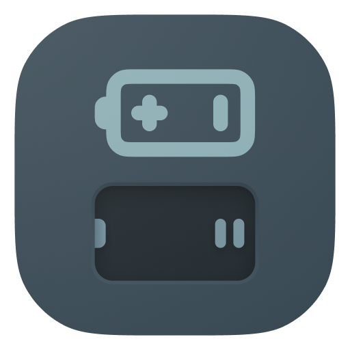

    

<h1 align="center">
  Batteries Not Included
</h1>

We've all been there, using a library we've found that works well for just about every task you throw at it; until it doesn't.
There's some configuration that the developers have placed in the codebase that prevents you from using it.

Maybe there's some UI element you end up re-writing the logic for various times and wish there was a generic abstraction you could base them all off of?

That's the goal of this library: Provide developers a set of "batteries-not-included" generic utilities to take and base your code off of. What does "no-batteries-included" mean? We want to make no assumptions about the
places you'll be using the code. By making these utilities small-scale and abstracted, we have the ability to make our code modular and highly customizable.

Still having a hard time understanding what I mean? That's perfectly normal. Take a look around our packages for various items:

- [React Utilities](./lib/react/README.md)
- [JavaScript Utilities](./lib/utils/README.md)
- More coming soon

While this package is in a pre-release stage, we will be following the semver
release schedule. If there is a breaking change in the pre-release state, we will bump the `minor`
number.
