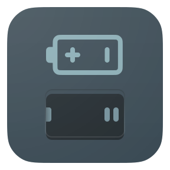

<h1>Batteries Not Included</h1>

Highly configurable React & JavaScript utilities

Visit https://unicorn-utterances.github.io/batteries-not-included to get started with `batteries-not-included`.

# Contributing
If you've ever wanted to contribute to open source, now is your chance!

See the [contributing docs](./CONTRIBUTING.md) for more information
